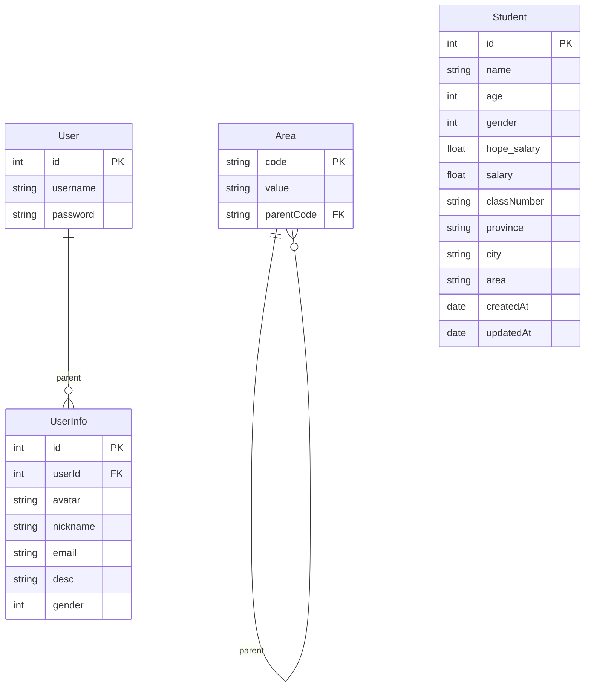

```mermaid
erDiagram
    User {
        int id PK
        string username
        string password
    }

    Area {
        string code PK
        string value
        string parentCode FK
    }

    UserInfo {
        int id PK
        int userId FK
        string avatar
        string nickname
        string email
        string desc
        int gender
    }

    Student {
        int id PK
        string name
        int age
        int gender
        float hope_salary
        float salary
        string classNumber
        string province
        string city
        string area
        date createdAt
        date updatedAt
    }

    User ||--o{ UserInfo : parent
    Area ||--o{ Area : parent
```
